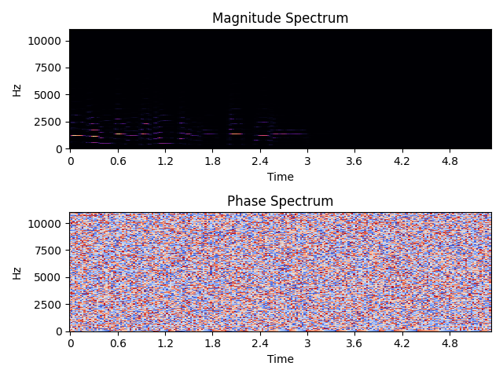
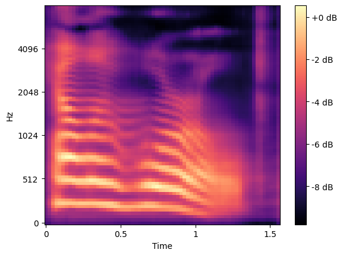
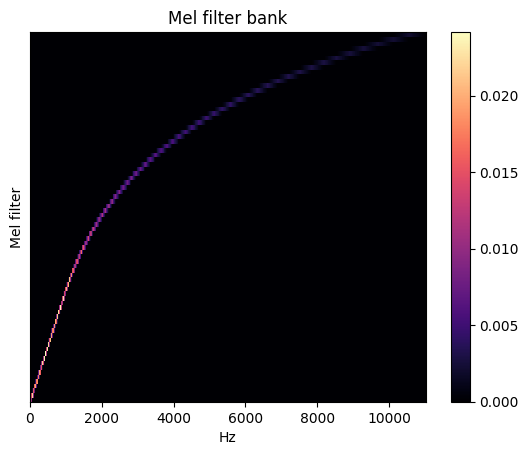
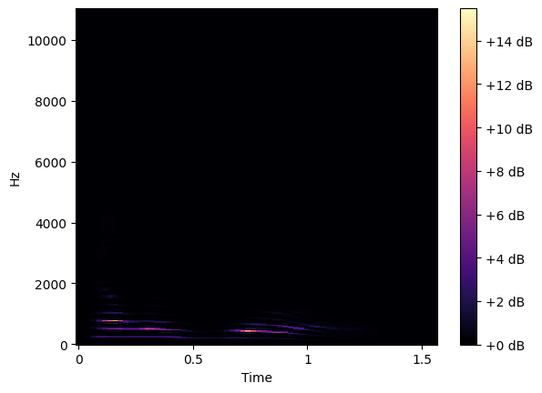
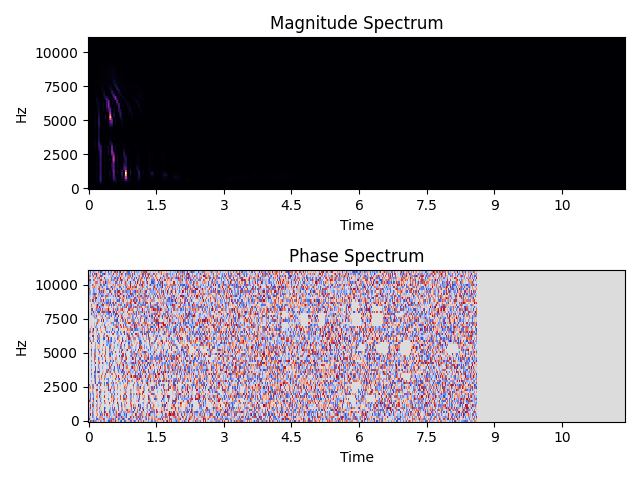
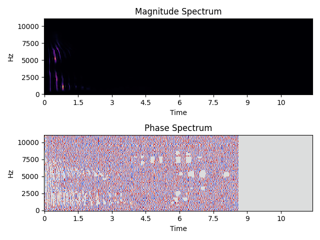
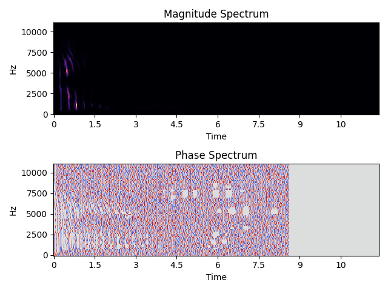

# Stepping Through Griffin-Lim

## Introduction

This is an accompaniment to the Rustnation 2024 talk "Creating a Text-To-Speech
System in Rust" and is using a spectrogram of "Hello world" generated using a
version of that TTS system.

It also uses `examples/run_griffin_lim.rs` to generate the output with the `debug_dump`
feature enabled to grab npy files of intermediate phases.

## Prerequistite Knowledge

So before we dive into things there's going to be some foundational maths as with any
signal processing. But this will be kept simpler just to ensure the concepts are understood.

When we look at a sound wave that's a representation of a signal in the time domain. But we
can also look at spectrograms which are a representation of the signal in the frequency
domain.

#

At the top we have the magnitude domain, this shows for each time slice and frequency the
amplitude of different sine waves we'd compose to recreate that signal. Below it is the
phase, this is the offset in time we'd apply to those same sine waves.

A Short Time Fourier Transform (STFT) is a discrete fourier transform ran on overlapping windows
so we can look at the frequency information of smaller localised slices of time instead
of the frequency information for the entire audio signal.

## Going from Mel to Linear

So to start lets look at our spectrogram we're going to be vocoding.



To vocode this we need to reconstruct the phase spectrum so we can do an inverse
(STFT) to reconstruct the audio.

The mel spectrogram uses mel frequency bands to compress a linear spectrogram to
a more compressed representation. It does that by multiplying the linear spectrogram
by a filter bank. So we need to invert that multiplication to go back to a linear
spectrogram. This is an optimisation problem as with matrix multiplication AB != BA.

So we use a limited-memory [BGFS](https://en.wikipedia.org/wiki/Broyden–Fletcher–Goldfarb–Shanno_algorithm) solver to solve for the inverse of the matrix 
multiplication. This is mainly to keep in line with the reference implementation we used.

So if we construct the mel filter bank we get:



Using these two matrices we invert and get the following linear spectrogram:



It's expected that this will look a lot emptier higher up, the human ear is more
sensitive to lower frequencies so the mel spectrogram conversion throws away a lot
of high frequency data and accentuates the low frequency data. Near the bottom of
the spectrogram we can see a hint of the mel spectrograms form.

## Estimating the Phase Spectrum

The above linear spectrum was only the magnitude component, the phase is harder to
predict so often algorithms will generate a magnitude spectrum and then use an 
algorithm like Griffin-Lim to reconstruct the phase information.

So in this crates internals we either initialise a random phase spectrum (default)
or start from zeroes. There's no benefit to starting from zeroes it just makes tests
repeatable. It's typical in algorithms like this to allow users to either set a
random seed or a fixed initialisation to enable reproducable results when used in
research.

```rust
let mut estimate = if params.init_random {
    let mut angles = Array2::<T>::random_using(
        spectrogram.raw_dim(),
        Uniform::from(-T::PI()..T::PI()),
        &mut rng,
    );
    // realfft doesn't handle invalid input
    angles.slice_mut(s![.., 0]).fill(T::zero());
    angles.slice_mut(s![.., -1]).fill(T::zero());
    &spectrogram * &angles.mapv(|t| Complex::from_polar(T::one(), t))
} else {
    spectrogram.clone()
};
```

Now we have our initial guess at a complete spectrogram with magnitude and
phase components we can start to try and estimate better phase information. The
steps for this in Griffin-Lim is remarkably simple.

1. Perform an inverse STFT to get audio data
2. Perform an STFT to go back to the frequency domain
3. Replace magnitude with our "known correct" magnitude and adjust phase
4. Repeat until stopping criteria is met

But how does this work? Well, if we change the phase then the frequencies
intefere with each other and will change the resulting magnitude spectrum.
We don't want to change our magnitude so then reapplying it to the rebuilt spectrum
negates that inteference and we should end up with a phase that inteferes less.
This prioritises making the signal consistent in that each ISTFT/STFT pair result
in the same spectrogram.

However, successive FFTs will cause the phase to gradually drift in one direction,
this can result in the warbly sound that people complain of with Griffin-Lim and
ultimately why it's been abandoned for slower but more accurate neural network based
vocoders.

This is only a high level overview if you're interested in understanding this
more fully the paper for Griffin Lim can be found easily via Google. Also the maths
behind this generally comes from signal processing (STFT, Fourier Transforms)
and non-linear optimisation (BGFS). There are numerous courses/videos/books
that cover these if you want to find a resource to go deeper into it.

### Some Sample Steps

Where we start on our estimate:



After the first iteration:



The end:



Now I'm not sure where these blocks come from in the spectrogram generation,
the current feeling is it's a mistake in my plotting or some nuance of librosa
fiddling with the spectrogram for plotting purposes. Any insight on this would
be appreciated!

## The Audio

And listen to the output:


## Conclusion

Hopefully this was insightful to some of the process. One thing skipped is that
this is a "fast" version of Griffin-Lim which adds a momentum parameter to move
more quickly towards convergence. We also made substantial use of
[librosa](https://librosa.org/) as a reference implementation to test correctness
and examine how the algorithm works.
